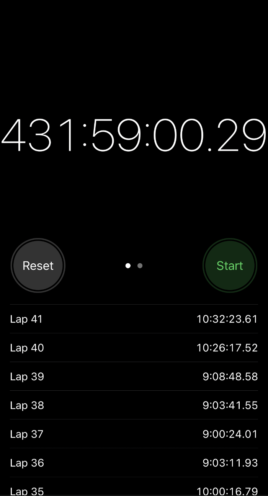

# timemit - Why another stopwatch?

I **love** using stopwatches – especially over prolonged time intervals. However, there is one utterly infuriating property of the default stopwatch app: A single, perhaps accidental, touch of the treacherous «Reset» button annihilates everything, with no option to undo.

 
<table>
  <tr>
    <td></td>
    <td></td>
  </tr>
  <tr>
     <td style="text-align: center">iOS Stopwatch 👎</td>
     <td style="text-align: center">✨<i>timemit</i>✨</td>
  </tr>
 </table>
 

So what does _timemit_ [/taɪmɪt/](http://ipa-reader.xyz/?text=taɪmɪt) do differently? First and foremost, rather than expunging all your precious records instantaneously, pressing «Reset» will ask for your confirmation before anything is done. Furthermore, you can modify, delete and rename each time split.

## Setup

To start the app locally, run:

    nvm use
    npx expo start

### Update Icons

Follow the instructions [here](https://docs.expo.dev/guides/app-icons/), while using [this Figma file](<https://www.figma.com/file/WXGPoWYsqeAgdCSo80IHV6/Expo-App-Icon-%26-Splash-(Community)?node-id=1%3A1357&t=kjvFzlWC2BSILXJ8-1>).
